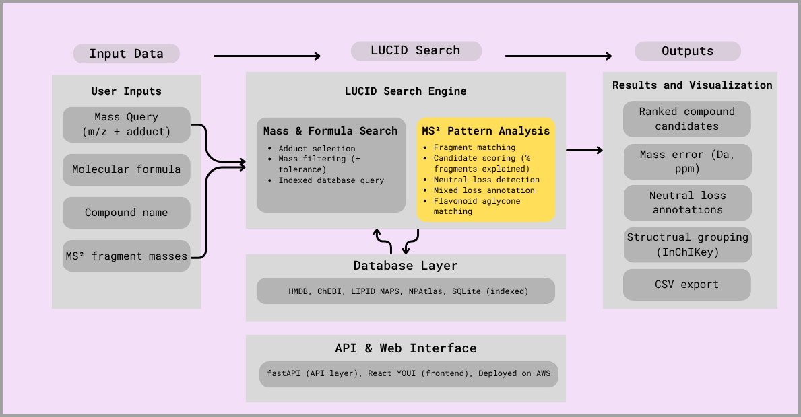

# LUCID: LC-MS Unified Compound Identification Database

A full-stack metabolomics platform for **LC-MS compound identification**, combining exact mass search with **MS² fragmentation pattern analysis**.

LUCID integrates multiple metabolomics databases and provides both **mass-based candidate retrieval** and **structure-aware MS² interpretation**, with a fast web interface and deployable API.

---

## Overview

LUCID enables researchers to:

- Identify compounds from **LC-MS (MS¹)** data using exact mass and adduct-aware search  
- Interpret **MS² fragmentation patterns** for structural insight  
- Annotate **flavonoid glycosides and natural products** using neutral loss ladders  
- Query across **500k+ curated compounds** (millions with extended imports)

---

## System Architecture

**Figure 1. Overview of the LUCID workflow for LC–MS compound identification.**  
User inputs (mass, formula, name, or MS² fragments) are processed by the LUCID search engine using adduct-corrected mass matching, indexed database queries, and MS² pattern analysis. Results are returned as ranked candidate compounds with annotations from a unified database (HMDB, ChEBI, LIPID MAPS, NPAtlas).

---

## Core Features

### 1. Mass & Formula Search (MS¹)

LUCID provides a highly flexible and fast search interface for MS¹ data:

- **Exact mass search** with user-defined tolerance (ppm or Da)  
- **Custom adduct selection** (e.g., `[M+H]+`, `[M+Na]+`, `[M+K]+`, `[M-H]-`, etc.)  
- **Batch search**: query multiple masses simultaneously  
- **Formula search**: exact molecular formula lookup  
- **Database selection**: choose which sources to search (HMDB, ChEBI, LipidMaps, NPAtlas, FooDB, PubChem)  
- **Adjustable candidate limits**: control number of returned hits  
- **Fast indexed queries** (~1–10 ms)  

---

### 2. MS² Fragmentation Analysis (NEW)

- Fragment matching against candidate structures  
- Candidate scoring (% fragment coverage)  
- Neutral loss detection (e.g., hexose, deoxyhexose, acyl groups)  
- **Sequential fragmentation ladder reconstruction**  
- Aglycone identification  
- Isobar ambiguity detection  

**Current scope:**
- Optimized for **flavonoid glycosides**

> If you have ideas for additional compound classes or fragmentation patterns, feel free to open an issue or reach out.

---

## Example

**Input:**

301.0354, 463.0882 [M-H]-

**Output:**
- Predicted structure: quercetin + hexose  
- Aglycone: quercetin (301.0354 Da)  
- Neutral loss: 162 Da (hexose)  
- Fragment coverage: ~50%  

---

## Database Coverage

| Source      | Compounds | Focus                     |
|-------------|-----------|---------------------------|
| HMDB        | 217,879   | Human metabolites         |
| ChEBI       | 190,800   | Biochemical compounds     |
| LipidMaps   | 49,719    | Lipids                    |
| NPAtlas     | 36,454    | Natural products          |
| FooDB       | ~28,000   | Food metabolites          |
| PubChem     | ~5,000,000| Broad chemical space      |
| **Total**   | **~5,500,000+** | |

---

## Web App & API

- Web app: https://lucid-lcms.org  
- API docs: https://api.lucid-lcms.org/docs  

---

## Citation

Manuscript in preparation.

If you use LUCID in your research, please cite:

**LUCID: LC-MS Unified Compound Identification Database (in preparation)**

---

## References

HMDB:  
Wishart DS, et al. *HMDB 5.0: the Human Metabolome Database*. Nucleic Acids Res. 2022.

ChEBI:  
Hastings J, et al. *ChEBI in 2016: Improved services and an expanding collection*. Nucleic Acids Res. 2016.

LIPID MAPS:  
Fahy E, et al. *Update of the LIPID MAPS comprehensive classification system*. J Lipid Res. 2009.

NPAtlas:  
van Santen JA, et al. *The Natural Products Atlas*. ACS Cent Sci. 2019.

PubChem:  
Kim S, et al. *PubChem in 2021: new data content and improved web interfaces*. Nucleic Acids Res. 2021.

---

## License

MIT License

---

## Contact

Developed by Elane Shane  
For questions or collaboration: open an issue on GitHub